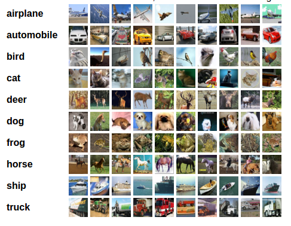

# cifar10-classification

classifying objects into 10 classes.

## `simple.lua`
Deep Neural net of 6 fully connected layers in Torch7

## `convnet.lua`
16 layered ConvNet in Torch7 with dropout for Fully connected layers

## `conv.py`
8 layered ConvNet in Keras with dropout after every max-pooling and fully connected layers

## `res.py`
Microsoft's ResNet20 implemented in Keras